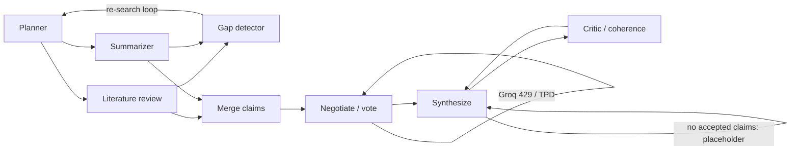

# SwarmIQ

Multi-agent research pipeline: **LangGraph**, **Groq**, **LanceDB**, and web search (**DDG** + **Jina Reader** + trafilatura).

**Setup:** `pip install -r requirements.txt`, copy `.env.example` to `.env`, set `GROQ_API_KEY`. Search uses the **`ddgs`** package only. If logs show `duckduckgo_search` rename warnings, run **`pip uninstall duckduckgo_search -y`** so only `ddgs` is installed.

**Low RAM / Windows page file:** If negotiation crashes loading the cross-encoder (`OSError: paging file is too small`, 1455), set **`SWARMIQ_DISABLE_RERANK=1`** in `.env`. The pipeline then keeps **embedding** re-ranking but skips the second HF model and orders hits by vector distance.

**API (SSE):** from this directory run `python app.py`, then `POST http://localhost:8000/api/run` with JSON `{"query":"..."}`. Events: `log`, `ping` (~12s keepalive), then `complete` or `error`. **OpenAPI `/docs` buffers the whole response** until the run ends—use `curl -N -H "Content-Type: application/json" -d "{\"query\":\"...\"}" http://localhost:8000/api/run` for live output. Health: `GET /api/health`.

**CLI:** `python main.py`. **Web UI:** from `frontend/` run `npm install` and `npm run dev` (Vite proxies `/api` to `http://127.0.0.1:8000`; set `VITE_API_PROXY_TARGET` if the API uses another port). For direct browser→API calls, set `VITE_API_BASE_URL` and extend CORS with env `SWARMIQ_CORS_ORIGINS` (comma-separated). **Test:** `pytest tests/ -q`.

**Coherence (critic):** The score comes from a **local** composite in `evaluation/coherence_scorer.py` (citation density, required sections, references/URLs, length-based slot where BERTScore would go). **BERTScore is intentionally off by default** to avoid a large first-run model download. Empty pipeline sources cap the score and fail the check so unsourced reports cannot look “perfect.”

**Docs:** [LIMITATIONS.md](LIMITATIONS.md) (honest operational limits), [DEMO_SCRIPT.md](DEMO_SCRIPT.md) (~90s walkthrough). Optional: save a successful API **`complete` event JSON** as `demo_run.json` here for offline UI replay (not shipped in-repo).

*Notes on the diagram:* **Synthesize → self** when there are zero accepted claims (no confabulated long report). The **gap-driven re-search loop** also spaces search calls and can mitigate flaky DDG/Bing responses (see LIMITATIONS.md). **Negotiate** may log rate-limit fallbacks into `phase_log` for the SSE activity feed.
